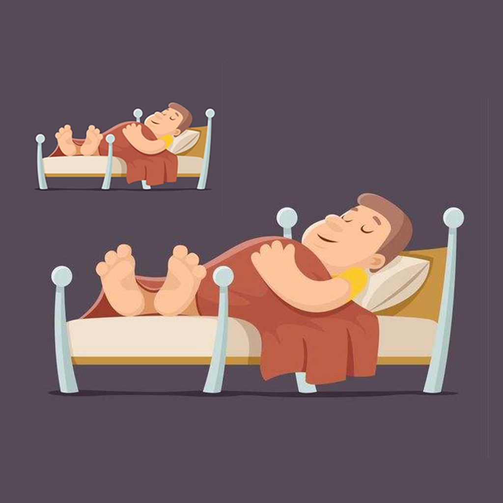

## 欢迎来到 我的午休质量记录工具

不知道你是否也有午休的习惯，而午休的睡眠质量好坏，直接影响到我们下午的工作效率和精神状态。
这款应用就是帮助你管理你的睡眠质量和安排，你可以记录每次午休选择的睡眠时间，和睡眠地点。你还可以关注当时
睡眠周围的环境，是否安静和嘈杂等影响因素。还可以记录每次睡眠结束后，醒来的精神状态和心情等信息，帮助你更好的
了解自己的午休质量，让生活更加健康和高效。

如果您遇到什么需要解答的问题，请发送您的问题到以下邮箱。

我们将第一时间为您解答。

### 邮箱地址:  jichungan9498@163.com

谢谢！
